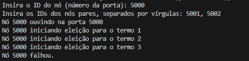

**Alunos:** 

LUCAS DE LIMA BENVENUTI / 20030714

SAMUEL FAGUNDES CESCA / 22877161

VINICIUS MARTINS DOS SANTOS / 22901219

SAMANTHA DELL VECCHIO ESTEVES / 22871941

RENAN OLIVEIRA DA SILVA / 22020962

## 1. Descrição do Projeto

**Descrição do Projeto:** Este projeto é uma implementação simplificada do algoritmo de consenso distribuído Raft em Python!

**Objetivo:** O objetivo é simular um ambiente distribuído onde múltiplos nós colaboram para manter um log replicado e consistente, garantindo que todos os nós concordem sobre o estado do sistema.

**Algoritmo Implementado:** O algoritmo Raft foi escolhido por ser mais fácil de implementar em comparação com outros algoritmos de consenso.

## 2. Configuração do Ambiente e Execução do Código

### 2.1. Pré-requisitos

- **Python 3.6** ou superior instalado no sistema.
- Bibliotecas padrão do Python.

### 2.2. Executando o Projeto: Passos para Executar um Nó

1. **Execute o script `server.py`:**

   ```bash
   python server.py
   ```

2. **Informe o ID do Nó:**

   Ao executar o script, você será solicitado a inserir um ID para o nó. Este ID será usado como o número da porta para comunicação. Escolha um número de porta único para cada nó (por exemplo, 5000, 5001, 5002, etc.).

   ```
   Insira o ID do nó (número da porta): 5000
   ```

3. **Informe os IDs dos Nós Pares:**

   Insira os IDs (números de porta) dos outros nós com os quais este nó irá se comunicar, separados por vírgulas.

   ```
   Insira os IDs dos nós pares, separados por vírgulas: 5001,5002
   ```

4. **Repita os passos em novos terminais** para iniciar outros nós, garantindo que cada nó tenha um ID único e conheça os IDs dos seus pares.

## 3. Fases do Algoritmo na Implementação

### 3.1. Estados dos Nós

(Importante!) Cada nó pode estar em um dos três estados:

- **Seguidor (Follower):** Estado inicial. Aguarda mensagens do líder.
- **Candidato (Candidate):** Estado ao qual um nó transita ao iniciar uma eleição.
- **Líder (Leader):** O nó que coordena o cluster e replica o log para os seguidores.

### 3.2. Eleições de Líder

#### 3.2.1. Temporizador de Eleição

Cada nó inicia com um temporizador de eleição definido para um valor aleatório entre 5 e 10 segundos. Se o nó não receber um heartbeat do líder antes que o temporizador expire, ele inicia uma eleição.

#### 3.2.2. Processo de Eleição

- **Transição para Candidato:**

  - O nó incrementa seu termo atual.
  - Vota em si mesmo.
  - Reinicia o temporizador de eleição.

- **Solicitação de Votos:**

  - Envia mensagens de `SolicitarVoto` para todos os nós pares.

- **Recebimento de Votos:**

  - Cada nó par responde com um voto, desde que não tenha votado em outro nó para aquele termo.
  - Se o candidato receber votos da maioria dos nós (incluindo seu próprio voto), torna-se líder.

- **Resolução de Eleições Concorrentes:**

  - Se dois nós iniciarem eleições simultaneamente, o nó com o termo mais alto vence.
  - Se os termos forem iguais, a eleição é indecisa, e novos tempos de espera aleatórios resolvem o conflito em rodadas subsequentes.

### 3.3. Replicação de Log (Simplificada)

Após se tornar líder, o nó começa a enviar mensagens de `AdicionarEntradas` (heartbeats) periodicamente para os seguidores para manter sua liderança e atualizar os logs.

#### 3.3.1. Heartbeats

- Enviados a cada 0,1 segundos.
- Reiniciam o temporizador de eleição dos seguidores.
- Nesta implementação, não estamos adicionando novas entradas de log de clientes, mas o mecanismo para replicação pode ser estendido.

### 3.4. Manuseio de Mensagens

- **SolicitarVoto:**

  - Quando um nó recebe uma mensagem de `SolicitarVoto`, ele verifica se já votou em outro nó para aquele termo.
  - Se não tiver votado, concede seu voto e reinicia seu temporizador de eleição.

- **AdicionarEntradas:**

  - Quando um nó recebe um `AdicionarEntradas` (heartbeat) de um líder válido, atualiza seu `id_lider` e reinicia o temporizador de eleição.

## 4. Descrição de Possíveis Falhas Simuladas e Como o Sistema Responde a Elas

### 4.1. Simulação de Falhas

- **Interrompendo a Execução do Nó:**

  - Fechando o terminal onde o nó está sendo executado.
  - Isso simula uma falha abrupta do nó.



- **Modificando o Código para Falha Programada:**

  No arquivo `node.py`, você pode adicionar o seguinte código para simular uma falha após 30 segundos:

  ```python
  def executar(self):
      tempo_falha = time.time() + 30  # Nó falhará após 30 segundos
      while True:
          time.sleep(0.1)
          if time.time() >= tempo_falha and self.estado != 'Falho':
              self.simular_falha()
  ```

### 4.2. Resposta do Sistema a Falhas

#### 4.2.1. Falha do Líder

- Os seguidores não recebem heartbeats do líder.
- Quando o temporizador de eleição de um seguidor expira, ele inicia uma nova eleição.
- Um novo líder é eleito entre os nós restantes.
- O sistema continua operando com o novo líder.

def executar(self):
    while True:
        time.sleep(0.1)
        with self.trava:
            tempo_atual = time.time()
            if self.id_no == 5000 and self.estado != 'Falho':
                # Simula a falha do líder após 30 segundos
                if not hasattr(self, 'falha_programada'):
                    self.falha_programada = tempo_atual + 30
                elif tempo_atual >= self.falha_programada:
                    self.simular_falha()
                    continue

